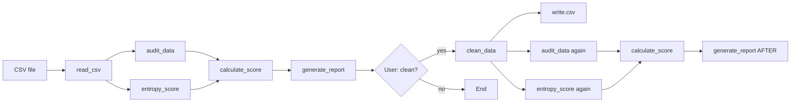

# Data Quality & Validation Engine — Code Documentation

This document is a **detailed, reference-style** description of the R codebase: purpose, file layout, each function, data flow, formulas, and limitations. Use it for study, handoffs, or presentation prep.

---

## Table of contents

1. [Purpose and workflow](#1-purpose-and-workflow)
2. [Project layout](#2-project-layout)
3. [Dependencies](#3-dependencies)
4. [Module: `main.R`](#4-module-mainr)
5. [Module: `audit.R`](#5-module-auditr)
6. [Module: `scoring.R`](#6-module-scoringr)
7. [Module: `cleaning.R`](#7-module-cleaningr)
8. [Module: `report.R`](#8-module-reportr)
9. [Shared data structures](#9-shared-data-structures)
10. [Scoring formula (reference)](#10-scoring-formula-reference)
11. [Entropy (reference)](#11-entropy-reference)
12. [How to run](#12-how-to-run)
13. [Design limitations (honest scope)](#13-design-limitations-honest-scope)

---

## 1. Purpose and workflow

**Goal:** Read a CSV, measure data-quality signals, compute a **0–100 score** with a **status** label, print a **report**, and optionally **clean** the data and show **before/after** metrics.

**High-level pipeline:**



---

## 2. Project layout

| File         | Role |
|-------------|------|
| `main.R`    | Entry script: load modules, read CSV, run pipeline, prompt, optional second pass. |
| `audit.R`   | All **measurement** checks (missing, duplicates, outliers, schema snapshot, regex). |
| `scoring.R` | **Entropy** (normalized Shannon) and **composite score** + status/severity. |
| `cleaning.R`| **Automatic cleaning** when user answers yes. |
| `report.R`  | **Console report** and optional **`explain_methods()`** talking points. |
| `sample.csv`| Example input (default path in `main.R`). |

---

## 3. Dependencies

| Package      | Used for |
|-------------|----------|
| `readr`     | `read_csv()` in `main.R`. |
| `dplyr`     | `select`, `mutate`, `across`, `distinct`, `where()` in `audit.R` / `cleaning.R`. |
| `stringr`   | `str_trim`, `str_to_lower` in `cleaning.R`. |
| `stringdist`| Levenshtein distance (`lv`), `stringdistmatrix` in `audit.R` / `cleaning.R`. |

Base R: `stats` (`quantile`, `na.omit`, `hclust`, `cutree`, `as.dist`), `grepl`, `table`, etc.

---

## 4. Module: `main.R`

### Purpose

Orchestrates execution only; **no quality logic** lives here beyond wiring.

### Behavior (step by step)

1. **`library(readr)`** — CSV reading.
2. **`source()`** of `audit.R`, `scoring.R`, `cleaning.R`, `report.R` — defines functions in the global environment.
3. **Input path**
   - `commandArgs(trailingOnly = TRUE)` collects arguments after `Rscript main.R --args ...`.
   - If at least one argument exists, **`csv_file <- args[1]`**; else **`"sample.csv"`**.
4. **`df <- read_csv(csv_file, show_col_types = FALSE)`** — loads data; suppresses column-type messages.
5. **`audit <- audit_data(df)`** — audit list (see §5).
6. **`ent <- entropy_score(df)`** — scalar in \([0,1]\) (see §6).
7. **`score_obj <- calculate_score(audit, ent, df)`** — list with `score`, `status`, `severity` (see §6).
8. **`generate_report(audit, score_obj, "BEFORE CLEANING")`** — printed summary (see §8).
9. **`readline(prompt = "...")`** — interactive yes/no. Compared as **`tolower(trimws(choice)) == "yes"`**.
10. If **yes**:
    - **`clean_df <- clean_data(df)`** — cleaning on the **original** `df`.
    - **`write.csv(clean_df, "cleaned_data.csv", row.names = FALSE)`**.
    - Recompute **`audit2`**, **`ent2`**, **`score2`** on **`clean_df`**.
    - **`generate_report(audit2, score2, "AFTER CLEANING")`**.
11. If **no**: message that no cleaning was performed.
12. **`explain_methods()`** is available from `report.R` but commented out by default.

---

## 5. Module: `audit.R`

### Function: `audit_data(df)`

**Returns:** A **named `list`** (see §9). All downstream code assumes these **exact names**.

#### 5.1 Missing values

| Output field      | Definition |
|------------------|------------|
| `missing_col`    | Named numeric vector: per column, **100 × (NA count / n rows)**. |
| `missing_total`  | **100 × (total NA cells / (n × p))** — overall sparsity across the grid. |

#### 5.2 Exact duplicates

| Output field   | Definition |
|----------------|------------|
| `exact_dup`    | **`sum(duplicated(df))`** — number of rows that duplicate an earlier row (full-row match). |

#### 5.3 Fuzzy duplicate pairs (first character column only)

- Select **`char_cols <- df %>% select(where(is.character))`**.
- If there is at least one character column and **`n >= 2`**:
  - **`v <- char_cols[[1]]`** (only the **first** text column).
  - For every pair **`(i, j)`** with **`i < j`**:
    - If both **`v[i]`**, **`v[j]`** are non-NA and **`stringdist(..., method = "lv") <= 2`**, increment **`fuzzy_dup`**.

**Interpretation:** Count of **unordered pairs** of rows whose values in that column are **very close** in edit distance (typo / variant signal). **Not** “number of bad rows.”

#### 5.4 String clustering (`stringdistmatrix` + `hclust`)

- Take **unique** non-NA values **`u`** from the same first character column.
- If **`2 <= length(u) <= 200`**:
  - **`m <- stringdistmatrix(u, u, method = "lv")`**
  - **`hclust(as.dist(m))`** then **`cutree(..., h = 3)`** — cut dendrogram at height **3**.
  - **`fuzzy_clusters <- sum(table(cl) > 1)`** — number of clusters that contain **more than one** distinct string.

**Interpretation:** How many **multi-string groups** appear at that cut height (illustrative “typo families”).

#### 5.5 Outliers (IQR rule)

- For each **numeric** column:
  - Q1, Q3, IQR = Q3 − Q1.
  - Lower fence **Q1 − 1.5×IQR**, upper **Q3 + 1.5×IQR**.
  - Count **non-NA** values outside \([low, high]\).
- **`outliers`**: **sum of those counts** over all numeric columns.

#### 5.6 Schema snapshot

| Output field | Definition |
|-------------|------------|
| `schema`    | **`data.frame`** with columns **`column`**, **`r_type`** — each column’s **`class()`** pasted as text. |

**Purpose:** Human-readable “what R thinks this is” — not full statistical typing inference.

#### 5.7 Regex validation

**Email** (only if column name is exactly **`email`**):

- Pattern: practical RFC-like check — local part, `@`, domain with dot.
- **`invalid_email`**: rows where email is **not NA** and **does not match**.

**Phone** (optional column):

- First column whose name matches **`^phone$|^mobile$`** (case-insensitive).
- Pattern: optional **`+`**, digit, then at least 7 more characters from digits / space / dash / parens.
- **`invalid_phone`**: non-NA, non-empty values that fail the pattern. If no such column, count stays **0**.

---

## 6. Module: `scoring.R`

### Function: `entropy_normalized(x)`

**Input:** Vector **`x`** (typically one column).

**Steps:**

1. Remove NAs. If empty, return **1** (neutral: no penalty signal).
2. **`table(x)`** → counts; **`p <- count / length(x)`** for non-zero categories only in the sum.
3. **Shannon entropy (base 2):**  
   \[
   H = -\sum_i p_i \log_2(p_i)
   \]
4. **k** = number of categories. If **k ≤ 1**, return **0** (no diversity).
5. **Normalized entropy:**  
   \[
   H_{\text{norm}} = \frac{H}{\log_2(k)}
   \]
   Maximum **H** for **k** categories is **log₂(k)** when categories are uniform, so **H_norm ∈ [0,1]**.

**Interpretation:**

- **High (near 1):** labels are **spread** across categories.
- **Low (near 0):** one label **dominates** (or only one level).

### Function: `entropy_score(df)`

- Subset **character** columns: **`df[sapply(df, is.character)]`**.
- If none: return **1** (no text → no entropy penalty in the mean).
- Else: **mean** of **`entropy_normalized`** over those columns.

### Function: `calculate_score(audit, entropy_val, df)`

**Inputs:**

- **`audit`**: list from **`audit_data`**.
- **`entropy_val`**: scalar from **`entropy_score`**.
- **`df`**: same frame (for **n** and **ncol**).

**Penalties** (each **capped**):

| Symbol        | Formula (conceptual) | Cap |
|---------------|----------------------|-----|
| `pen_miss`    | `min(30, missing_total × 0.5)` | 30 |
| `pen_dup`     | `min(25, (exact_dup + fuzzy_dup) / n × 100 × 0.35)` | 25 |
| `pen_out`     | `min(20, outliers / (n×p) × 100 × 0.4)` | 20 |
| `pen_fmt`     | `min(20, (invalid_email + invalid_phone) / n × 100 × 0.35)` | 20 |
| `pen_ent`     | `min(15, (1 - entropy_val) × 100 × 0.12)` | 15 |

**Score:**

\[
\text{score} = \text{clip}_{[0,100]}\left(100 - \sum \text{penalties}\right)
\]

**Status bands:**

| Condition   | `status`            |
|------------|---------------------|
| score ≥ 80 | `"Approved"`        |
| 50 ≤ score < 80 | `"Needs Improvement"` |
| score < 50 | `"Rejected"`        |

**Severity** (for reporting):

| Condition   | `severity`   |
|------------|--------------|
| score ≥ 80 | `"Info"`     |
| 50 ≤ score < 80 | `"Warning"` |
| score < 50 | `"Critical"` |

**Return value:** `list(score, status, severity)` with **`score`** rounded to **1** decimal.

---

## 7. Module: `cleaning.R`

### Function: `clean_data(df)`

**Order of operations** (intentional):

1. **Character normalization**  
   `mutate(across(where(is.character), ~ str_to_lower(str_trim(.))))`  
   Trims whitespace; lowercases text.

2. **Missing value imputation**  
   - **Numeric:** NA → **median** of column (with `na.rm = TRUE`).  
   - **Other:** NA → **mode** (most frequent value from `table`).

3. **Email repair** (if **`email`** exists)  
   Same validity regex as audit. Invalid rows → replaced by **most frequent valid** email (if any valid exists).

4. **Exact deduplication**  
   **`distinct()`** — drop duplicate rows.

5. **Fuzzy deduplication** (if **`nrow >= 2`**)  
   - **Key** construction:
     - If **`name`** and **`city`** exist: **`paste(name, city)`**.
     - Else: from **`select(where(is.character))`** — paste first two char columns, or use one; if **no** char columns, **skip** fuzzy step (`key` stays `NULL`).
   - Nested loops: for **`stringdist(key[i], key[j], "lv") <= 2`**, mark **`keep[j] <- FALSE`** (later row dropped). **First** row in scan order is kept among close keys.

6. **Winsorization (numeric)**  
   Same IQR fences as audit; values **clamped** to **[low, high]** via **`pmin`/`pmax`**.

**Returns:** Cleaned **`data.frame`** / tibble.

---

## 8. Module: `report.R`

### Function: `generate_report(audit, score_obj, title = "DATA QUALITY REPORT")`

**Side effect:** Prints to the console (no file write).

**Sections:**

1. **Header** with **`title`**.
2. **Summary:** `missing_total`, `exact_dup`, `fuzzy_dup`, `fuzzy_clusters`, `outliers`, `invalid_email`, `invalid_phone`.
3. **Worst columns by missing %:** top **5** (or fewer) from **`sort(missing_col, decreasing = TRUE)`**.
4. **Score line:** `score_obj$score`, `status`, `severity`.

### Function: `explain_methods()`

Prints a short **narrative** suitable for live explanation: fuzzy distance, clustering, entropy normalization, scoring bands. No parameters; no return value (console only).

---

## 9. Shared data structures

### Audit list (`audit_data` output)

| Field              | Type / shape |
|--------------------|--------------|
| `missing_col`      | Named numeric vector (length = **p**). |
| `missing_total`    | Single numeric (percent). |
| `exact_dup`        | Integer count. |
| `fuzzy_dup`        | Integer count (pair count). |
| `fuzzy_clusters`   | Integer count. |
| `outliers`         | Integer count (cells). |
| `invalid_email`    | Integer count. |
| `invalid_phone`    | Integer count. |
| `schema`           | `data.frame`: `column`, `r_type`. |

### Score object (`calculate_score` output)

| Field       | Type    |
|------------|---------|
| `score`    | numeric |
| `status`   | character |
| `severity` | character |

---

## 10. Scoring formula (reference)

Starting point: **100**.

Subtract **five** penalties, each bounded above:

- **Missing:** scales with **`missing_total`**, cap **30**.
- **Duplicates:** scales with **`(exact_dup + fuzzy_dup) / n`**, cap **25**.
- **Outliers:** scales with **`outliers / (n·p)`**, cap **20**.
- **Format:** scales with **`(invalid_email + invalid_phone) / n`**, cap **20**.
- **Entropy:** scales with **`(1 - entropy_val)`**, cap **15**.

Final score clamped to **[0, 100]**.

---

## 11. Entropy (reference)

For one categorical column (non-NA values):

1. Empirical probabilities **`p_i`** from counts.
2. **H = −Σ p_i log₂(p_i)**.
3. **k** = number of distinct values.
4. **Normalized:** **H / log₂(k)** (0 if **k ≤ 1**).

**Dataset-level entropy score:** mean of per-column normalized entropies over **character** columns, or **1** if there are none.

---

## 12. How to run

From the project directory (with R installed):

```bash
Rscript main.R
```

With a custom CSV:

```bash
Rscript main.R path/to/data.csv
```

Interactive prompt: answer **`yes`** or **`no`** when asked to clean. For batch testing, pipe input (shell-dependent), e.g. PowerShell: `"no" | Rscript main.R`.

**Working directory** should be the folder containing **`main.R`** and the sourced files (or adjust paths).

---

## 13. Design limitations (honest scope)

| Topic | Limitation |
|-------|------------|
| Fuzzy audit | Uses **only the first** character column for pair counting and clustering. |
| Complexity | Pairwise loops are **O(n²)** — intended for **small** showcase data. |
| Fuzzy cleaning | Keeps **first** row among close keys; does not **merge** field-level data from duplicates. |
| Imputation | Median/mode and “most common valid email” are **heuristic**; not reviewed for compliance use cases. |
| Entropy | Measures **dispersion** of categories, not **correctness** of values. |
| Schema | Stores R **`class`**, not deep semantic typing (date formats, currency, etc.). |

---

*End of documentation. For the executable narrative version, see inline comments in each `.R` file and optionally call `explain_methods()` from R.*
